# FreshCart 🥬

FreshCart is a full-stack online grocery delivery web application. Customers can browse fresh produce, get an AI-assisted weekly meal plan, and check out as a guest or a registered account with multiple payment options. Store staff manage inventory, orders, delivery/discount adjustments, and a dedicated call-confirmation queue through a role-based admin console.

Built as a use-case-driven project: every field in the database traces back to an actual feature in the app, rather than being added speculatively.

**Live demo:** [frontend-production-dcf8.up.railway.app](https://frontend-production-dcf8.up.railway.app)

**API docs (Swagger):** [backend-production-a27f.up.railway.app/api-docs](https://backend-production-a27f.up.railway.app/api-docs)

---

## Features

### Customer-facing

- Browse products by category, with search (Shop page)
- Product images, descriptions, and stock status
- AI Planner — a sample weekly meal plan that matches suggested ingredients against the real product catalog before adding them to cart (never adds items that don't exist in inventory)
- Cart with quantity controls, persisted across page reloads
- Guest checkout **or** login/signup — customer's choice at checkout
- Multiple payment options: Cash on Delivery, Whish Money (with account number capture), Call for Confirmation (with a live "calling the store" confirmation step)
- Order confirmation via email and SMS (optional — gracefully skips if not configured)
- Contact page with a direct WhatsApp chat button

### Admin / staff console (role-based)

| Role           | Dashboard | Inventory | Orders | Call Center | Members |
| -------------- | --------- | --------- | ------ | ------------ | ------- |
| Admin          | ✅        | ✅        | ✅     | ✅           | ✅      |
| Store Manager  | ✅        | ✅        | ✅     | ✅           | ❌      |
| Employee       | ❌        | ✅        | ❌     | ❌           | ❌      |

- **Dashboard** — live revenue, order count, and stock stats
- **Inventory** — full product CRUD, including image (via URL) and category management
- **Orders** — status updates, and per-order delivery fee / discount adjustment (total recalculates automatically)
- **Call Center** — a filtered queue of orders paid via "Call for Confirmation," with click-to-call phone numbers
- **Members** — manage user accounts and roles (Admin only)

---

## Tech stack

**Backend:** Node.js, Express, MySQL (via `mysql2`), JWT authentication with bcrypt password hashing, `express-validator` for input validation, centralized error handling, Swagger (auto-regenerated on every startup) for live API docs, `nodemailer` + `twilio` for optional order notifications. Hosted on Railway.

**Frontend:** React (Vite), React Router, Context API for auth and cart state. Hosted on Railway.

**Database:** MySQL, designed from a use-case-driven ERD — 12 tables including lookup tables for order status, payment status, payment method, and role, so reference data is normalized rather than hardcoded.

---

## Database schema

The schema was designed from an ERD built around explicit use cases — every field traces back to an actual feature rather than being added speculatively. Core entities: `user`, `role`, `category`, `product`, `product_media`, `orders`, `order_item`, `order_status`, `payment`, `payment_method`, `payment_status`, `delivery`.

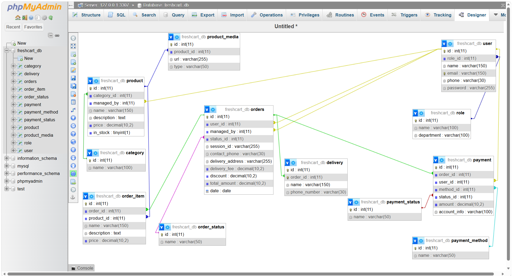

---

## Screenshots

### Home

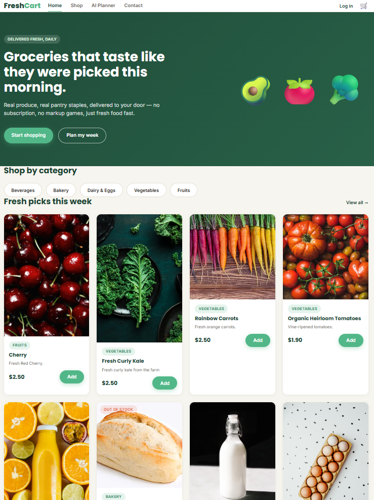

### Shop

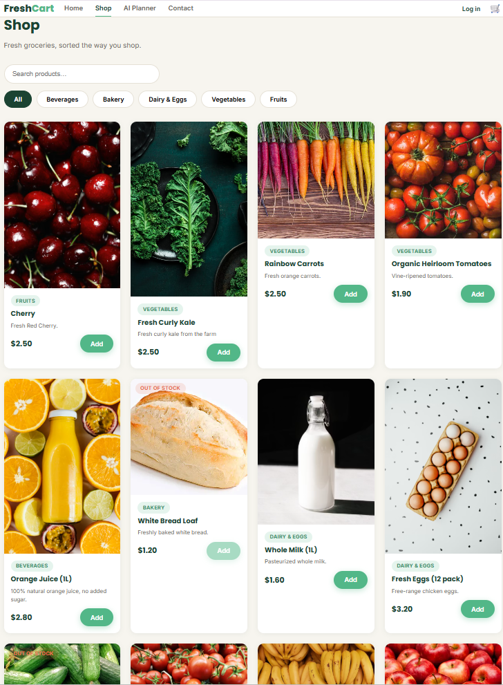

### Cart

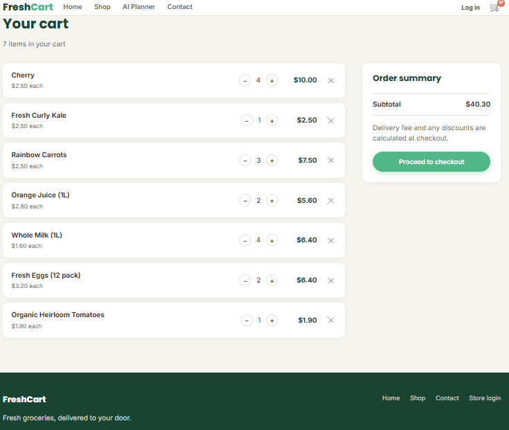

### Checkout

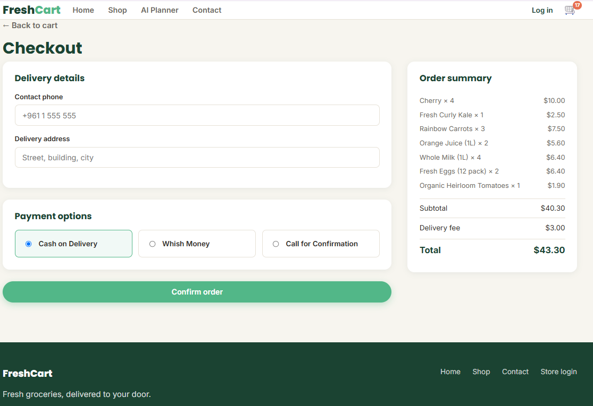

### Contact Us

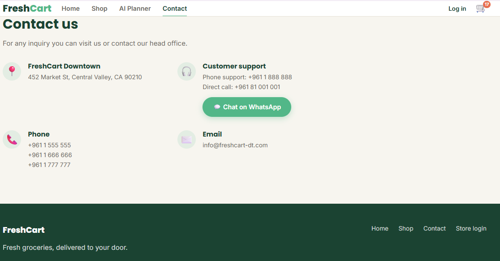

### Admin Dashboard

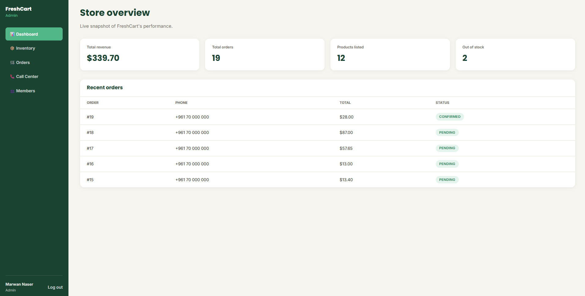

### Inventory management

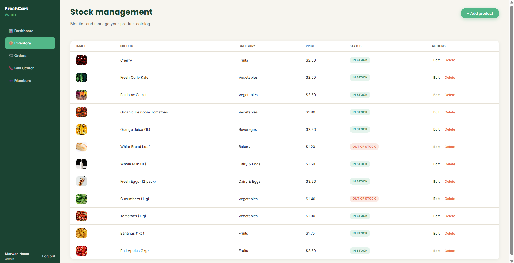

### Order management

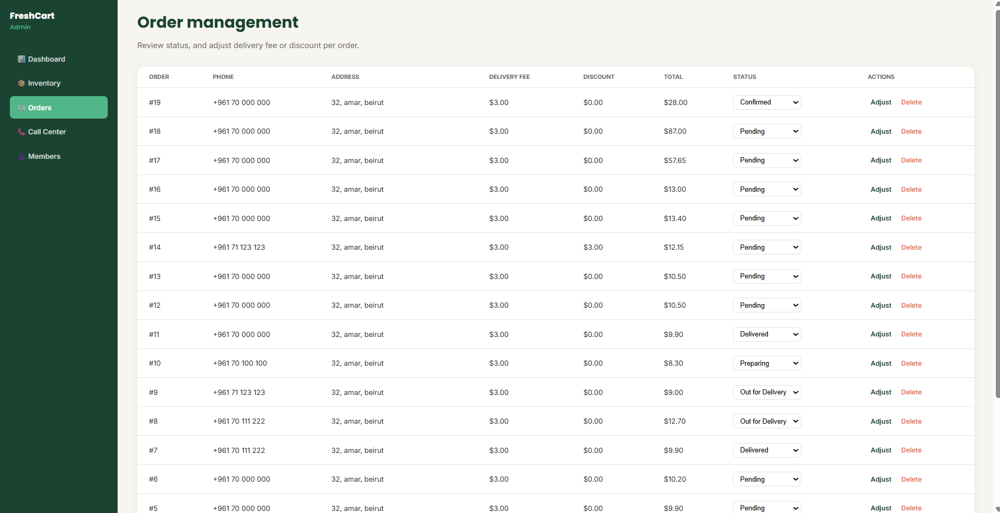

### Call Center

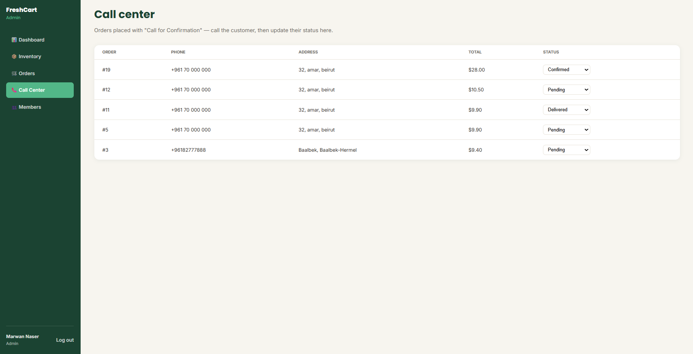

### Members

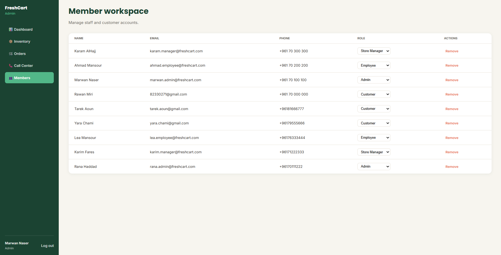

---

## Project structure

```text
my-app/
├── backend/          # Express API
│   ├── config/       # DB connection, role tiers
│   ├── controllers/  # Route handlers
│   ├── middleware/   # Auth, validation, error handling
│   ├── routes/       # API route definitions
│   ├── utils/        # Email/SMS helpers, error classes
│   └── server.js
└── frontend/         # React app
    └── src/
        ├── api/       # Central fetch client
        ├── context/   # Auth + Cart state
        ├── components/
        └── pages/
            └── admin/  # Store console pages
```

---

## Setup instructions (local development)

### Prerequisites

- Node.js (v18+ recommended)
- MySQL (e.g. via XAMPP)
- Git

### 1. Clone the repositories

```bash
git clone https://github.com/rawanmiri26-hub/freshcart-backend.git
git clone https://github.com/rawanmiri26-hub/freshcart-frontend.git
```

### 2. Set up the database

1. Create a MySQL database (e.g. `freshcart_db`) via phpMyAdmin or the MySQL CLI.
2. Import the schema and sample data (SQL export included in the project submission).

### 3. Backend setup

```bash
cd freshcart-backend
npm install
```

Copy `.env.example` to `.env` and fill in your values:

```env
PORT=5000
DB_HOST=localhost
DB_USER=root
DB_PASS=
DB_NAME=freshcart_db
JWT_SECRET=your_own_long_random_string

# Optional — order notifications (safe to leave blank)
EMAIL_HOST=
EMAIL_PORT=587
EMAIL_USER=
EMAIL_PASS=
EMAIL_FROM=
TWILIO_ACCOUNT_SID=
TWILIO_AUTH_TOKEN=
TWILIO_PHONE_NUMBER=

# Optional — restricts CORS to your frontend once deployed
FRONTEND_URL=
```

Run it:

```bash
npm run dev
```

The API will be live at `http://localhost:5000`, with interactive docs at `http://localhost:5000/api-docs`.

### 4. Frontend setup

```bash
cd freshcart-frontend
npm install
```

Copy `.env.example` to `.env`:

```env
VITE_API_URL=http://localhost:5000
```

Run it:

```bash
npm run dev
```

The app will be live at `http://localhost:5173`.

### 5. Create an admin account

Sign up normally through the app (`/signup`), then promote that account to Admin directly in the database:

```sql
UPDATE user SET role_id = 1 WHERE email = 'your-email@example.com';
```

Log in at `/store/login` to access the admin console.

---

## Deployment

Both the backend and frontend are deployed independently on [Railway](https://railway.app), each connected to its own GitHub repository for redeploys. The MySQL database also runs as a Railway service. Environment variables (`DB_*`, `JWT_SECRET`, `VITE_API_URL`, `FRONTEND_URL`, etc.) are configured per-service in Railway's dashboard rather than committed to the repo.

---

## API documentation

Full interactive API documentation (every endpoint, request/response shapes, and an in-browser "Try it out") is available via Swagger:

- **Local:** `http://localhost:5000/api-docs`
- **Live:** [backend-production-a27f.up.railway.app/api-docs](https://backend-production-a27f.up.railway.app/api-docs)
